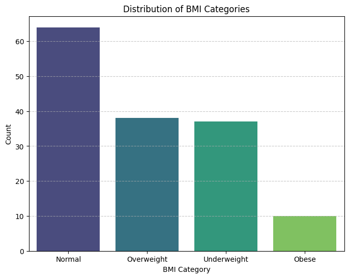
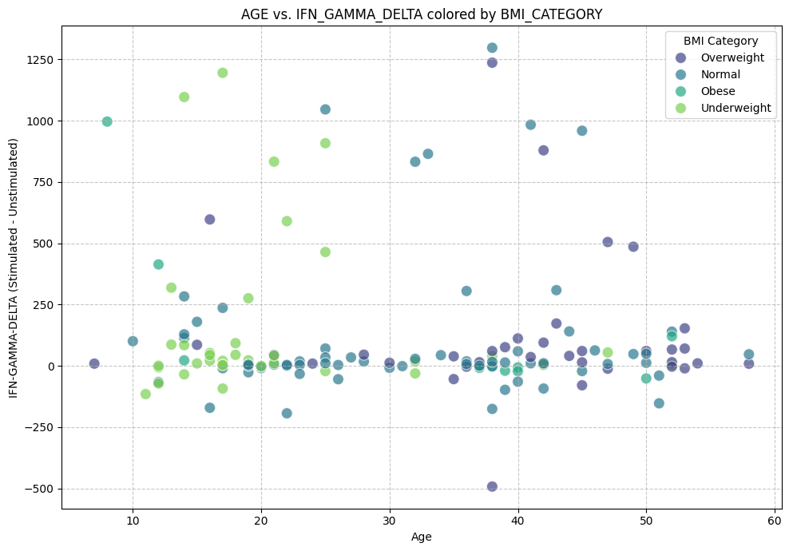
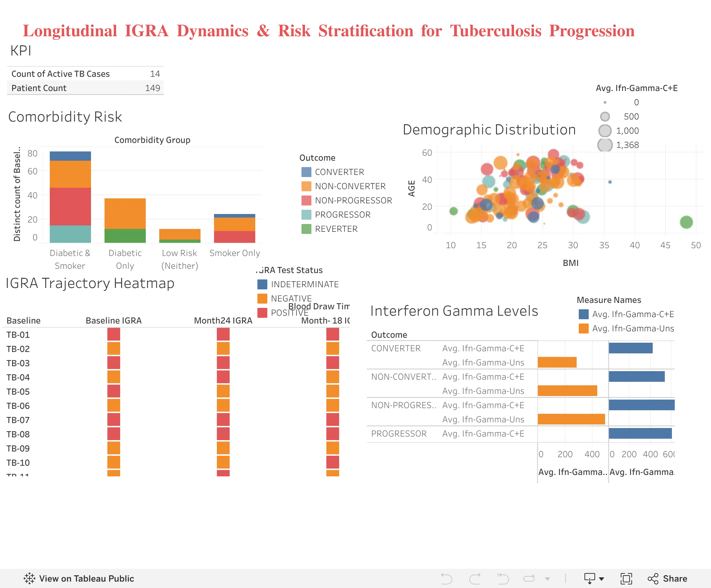

# 🫁 Longitudinal IGRA Dynamics & Risk Stratification for Tuberculosis Progression

[](https://colab.research.google.com/github/salonii-byte/tb-igra-longitudinal-analysis/blob/main/tb_project.ipynb)
[](https://public.tableau.com/app/profile/saloni.prasad3289/viz/TB_17851023282600/Dashboard1)

> **A 24-month cohort study analyzing IGRA diagnostic trajectories, biomarker patterns, and comorbidity-driven risk factors to identify individuals most likely to progress from Latent to Active Tuberculosis.**

---

## 📌 Table of Contents
- [Project Overview](#-project-overview)
- [Business Problem & Stakeholders](#-business-problem--stakeholders)
- [Dataset Schema](#-dataset-schema)
- [Analytics Framework](#-analytics-framework)
- [Key Findings](#-key-findings)
- [Dashboard](#-tableau-dashboard)
- [Folder Structure](#-folder-structure)
- [Tools & Technologies](#-tools--technologies)
- [Public Health Recommendations](#-public-health-recommendations)

---

## 📖 Project Overview

This portfolio project follows the **6-phase analytics framework (Ask → Prepare → Process → Analyze → Share → Act)** to conduct a longitudinal cohort analysis of **149 subjects tracked over 24 months** across five IGRA (Interferon-Gamma Release Assay) blood collection timepoints: Baseline, Month 6, Month 12, Month 18, and Month 24.

The study classifies subjects into five clinical trajectory groups and identifies the key risk multipliers driving progression from Latent TB to Active TB disease.

---

## 🎯 Business Problem & Stakeholders

### Primary Stakeholders
| Stakeholder | Need |
|-------------|------|
| **Public Health Program Directors & Epidemiologists** | Early identification of latent TB cases likely to progress to active disease |
| **Clinical Operations Managers** | Data-driven rules to prioritize diagnostic testing and preventive treatment allocation |

### Key Research Questions
1. What proportion of subjects progress to active TB disease over the 24-month monitoring window?
2. Which clinical, lifestyle, and demographic factors (Diabetes, Smoking, Age, BMI, Region) are most strongly associated with disease progression?
3. How do interferon-gamma levels (IFN-GAMMA-UNS vs. IFN-GAMMA-C+E) correlate with clinical outcomes?
4. What actionable interventions can public health authorities deploy to prevent progression to active TB?

---

## 📊 Dataset Schema

**149 subjects × 24 columns** — Longitudinal observational cohort data

| Feature | Data Type | Description |
|---------|-----------|-------------|
| `S.NO / Baseline` | String | Unique patient identifier and baseline ID |
| `AGE` | Numeric | Patient age in years |
| `GENDER` | Text | Patient gender |
| `HT` | Numeric | Height in cm |
| `WT` | Numeric | Weight in kg |
| `BMI` | Numeric | Body Mass Index (kg/m²) |
| `Baseline IGRA` to `Month24 IGRA` | Text (POSITIVE / NEGATIVE / INDETERMINATE) | IGRA status at Months 0, 6, 12, 18, and 24 |
| `BCG VACCINATION` | Text (Yes / No) | Prior BCG vaccination status |
| `SMOKING` | Text (Yes / No) | Smoking history |
| `DIABETES STATUS` | Text (Yes / No) | Diabetes comorbidity |
| `TB STATUS` | Text (Latent / Active) | Diagnostic outcome status |
| `OUTCOME` | Text | Clinical trajectory: CONVERTER, NON-CONVERTER, NON-PROGRESSOR, PROGRESSOR, REVERTER |
| `IFN-GAMMA-UNS` | Numeric | Unstimulated interferon-gamma concentration (pg/mL) |
| `IFN-GAMMA-C+E` | Numeric | Antigen-stimulated interferon-gamma concentration (pg/mL) |
| `REGION` | Text (Urban / Rural) | Geographic classification |

---

## 🔄 Analytics Framework

### 1. Ask — Business Problem Definition
Identified primary stakeholders and formulated four research questions to guide the analytical approach.

### 2. Prepare — Data Description
Reviewed the 24-column longitudinal schema across 149 subject entries. Identified key feature types, IGRA timepoint columns, and outcome classification logic.

### 3. Process — Data Cleaning & SQL Pipeline
- Standardized column headers and gender casing
- Computed BMI categories (Underweight / Normal / Overweight / Obese)
- Performed risk factor cross-tabulation by outcome group using BigQuery SQL

See: `sql/risk_stratification.sql`

### 4. Analyze — Cohort Insights
- Identified 100% comorbidity co-occurrence (Diabetes + Smoking) in the PROGRESSOR group
- Profiled IFN-Gamma biomarker patterns across all five outcome trajectories
- Conducted regional and demographic distribution analysis

See: `notebooks/01_data_cleaning_eda.ipynb` and `notebooks/02_colab_analysis.ipynb`

### 5. Share — Tableau Dashboard
Interactive 4-visual dashboard: Longitudinal IGRA Heatmap, Age vs BMI Scatterplot, Comorbidity Stacked Bar, Biomarker Grouped Bar Chart.

See: `visuals/`

### 6. Act — Public Health Recommendations
Four evidence-based interventions derived from cohort findings.

See: `reports/findings_summary.md`

---

## 🔍 Key Findings

### Cohort Trajectory Breakdown
| Outcome Group | N | % | Description |
|---------------|---|---|-------------|
| **NON-CONVERTER** | 67 | 45.0% | IGRA-negative across all 5 timepoints |
| **NON-PROGRESSOR** | 41 | 27.5% | Persistently IGRA-positive, no active disease |
| **PROGRESSOR** | 15 | 10.1% | IGRA-positive → Active TB |
| **REVERTER** | 15 | 10.1% | IGRA-positive at baseline → reverted to negative by Month 6 |
| **CONVERTER** | 11 | 7.4% | IGRA-negative → converted to positive during follow-up |

### SQL Risk Stratification Output
| Outcome | Total | Avg Age | Avg BMI | Diabetic | Smokers | Active TB | Avg IFN-γ C+E |
|---------|-------|---------|---------|----------|---------|-----------|----------------|
| PROGRESSOR | 15 | 31.0 | 21.55 | 15 | 15 | 14 | 610.78 |
| NON-CONVERTER | 67 | 28.8 | 21.84 | 47 | 33 | 0 | 538.10 |
| NON-PROGRESSOR | 41 | 36.9 | 23.55 | 31 | 41 | 0 | 650.23 |
| REVERTER | 15 | 28.5 | 21.94 | 12 | 0 | 0 | 619.45 |
| CONVERTER | 11 | 29.7 | 22.95 | 8 | 11 | 0 | 424.94 |

### Critical Insight
> **100% of PROGRESSOR patients (15/15) had both Diabetes AND Smoking history.**
> 14 out of 15 progressed to Active TB — representing **93.3% of all active TB cases** in the cohort.

### Biomarker Patterns (IFN-GAMMA-C+E)
| Outcome Group | Mean IFN-GAMMA-C+E |
|---------------|-------------------|
| NON-PROGRESSOR | 650.23 pg/mL |
| REVERTER | 619.45 pg/mL |
| PROGRESSOR | 610.78 pg/mL |
| NON-CONVERTER | 538.10 pg/mL |
| CONVERTER | 424.94 pg/mL |

---

## 📊 Exploratory Visualizations

### 1. BMI Category Distribution


### 2. Age vs. IFN-Gamma Response Delta by BMI Category


---

## 📊 Tableau Dashboard

> 🔗 **Live Dashboard on Tableau Public:** [**View Interactive Visualization**](https://public.tableau.com/app/profile/saloni.prasad3289/viz/TB_17851023282600/Dashboard1)

[](https://public.tableau.com/app/profile/saloni.prasad3289/viz/TB_17851023282600/Dashboard1)

*Click the image above to interact with the live dashboard on Tableau Public.*

### Dashboard Highlights:
- **Demographic & Biomarker Exploration:** Longitudinal tracking of IFN-Gamma levels and BMI correlations across 149 subjects.
- **Risk Stratification:** Clear separation of active vs. latent trajectories and comorbidity risk mapping.
- **Interactive Filtering:** Filter dynamically by region, clinical outcome, and timepoint.

> For technical field calculations and sheet configuration blueprints, see [`reports/tableau_dashboard_guide.md`](reports/tableau_dashboard_guide.md).

---

## 📁 Folder Structure

```
tb-igra-longitudinal-analysis/
│
├── README.md                         ← Project overview (this file)
├── tb_project.ipynb                  ← Colab interactive analysis with outputs & badge
│
├── data/
│   ├── raw/                          ← Original dataset (case_study.csv)
│   └── processed/                    ← Feature-engineered dataset (processed_tb_cohort_analysis.csv)
│
├── sql/
│   └── risk_stratification.sql       ← BigQuery SQL: cleaning + risk cross-tabulation
│
├── notebooks/
│   ├── 01_data_cleaning_eda.ipynb    ← Python EDA: cleaning, BMI, biomarker analysis
│   ├── 02_colab_analysis.ipynb       ← Pre-rendered tables & cohort aggregations
│   └── tb_project.ipynb              ← Colab interactive analysis
│
├── visuals/
│   ├── bmi_distribution.png          ← WHO BMI category bar chart
│   └── age_vs_ifn_gamma_delta.png    ← Age vs immune response delta scatterplot
│
└── reports/
    ├── findings_summary.md           ← Key clinical findings + recommendations
    └── tableau_dashboard_guide.md    ← Step-by-step Tableau dashboard blueprint
```

---

## 🛠 Tools & Technologies

| Category | Tool |
|----------|------|
| **Data Processing** | Python (Pandas, NumPy), SQL |
| **Database / Query Engine** | Google BigQuery |
| **Visualization** | Tableau Public |
| **Notebook Environment** | Jupyter Notebook |
| **Version Control** | Git & GitHub |

---

## 💊 Public Health Recommendations

1. **Targeted Screening** — Mandatory latent TB screening for all diabetic patients and active smokers
2. **Early TPT Rollout** — Scale short-course TB Preventive Treatment (3HP: weekly isoniazid + rifapentine for 3 months) for IGRA-positive and Converter patients
3. **Biomarker-Guided Monitoring** — Use IFN-GAMMA-C+E > 600 pg/mL as a secondary risk threshold for clinical prioritization
4. **Community Programs** — Integrate smoking cessation and glycemic control programs into primary healthcare

---

## 👩‍💻 Author

**Saloni Prasad**
Data Analyst | Public Health Analytics

*This project is part of a data analytics portfolio demonstrating end-to-end skills in SQL, Python, and data visualization applied to real-world public health data.*
